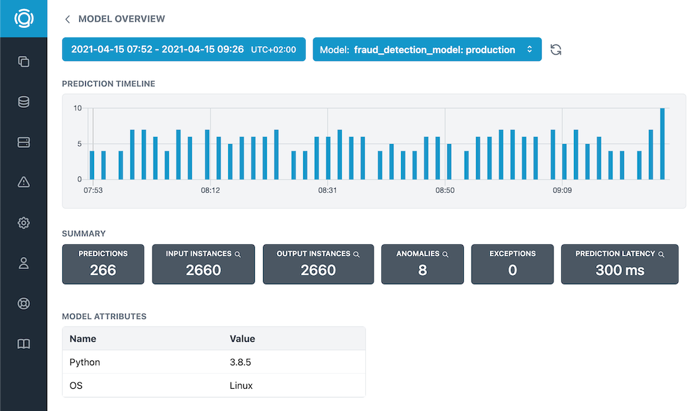

# Graphsignal Logger


## Overview

Graphsignal is a machine learning model monitoring platform. It helps ML engineers, MLOps teams and data scientists to quickly address issues with data and models as well as proactively analyze model performance and availability. Learn more at [graphsignal.com](https://graphsignal.com).




## Model Monitoring

* **Data monitoring.** Monitor offline and online predictions for *data validity and anomalies*, *data drift, model drift*, *exceptions*, and more.
* **Automatic issue detection.** Graphsignal automatically detects and notifies on issues with data and models, no need to manually setup and maintain complex rules.
* **Model framework and deployment agnostic.** Monitor models serving *online*, in streaming apps, accessed via APIs or *offline*, running batch predictions.
* **Any scale and data size.** Graphsignal logger *only sends data statistics* allowing it to scale with your application and data.
* **Data privacy.** No raw data is sent to Graphsignal cloud, only data statistics and metadata.
* **Team access.** Easily add team members to your account, as many as you need.


## Documentation

See full documentation at [graphsignal.com/docs](https://graphsignal.com/docs/).


## Getting Started

### 1. Installation

Install the Python logger by running

```
pip install graphsignal
```

Or clone and install the [GitHub repository](https://github.com/graphsignal/graphsignal).

```
git clone https://github.com/graphsignal/graphsignal.git
python setup.py install
```

Import the package in your application

```python
import graphsignal
```

### 2. Configuration

Configure the logger by specifying your API key.

```python
graphsignal.configure(api_key='my_api_key')
```

To get an API key, sign up for a free account at [graphsignal.com](https://graphsignal.com). The key can then be found in your account's [Settings / API Keys](https://app.graphsignal.com/settings/api_keys) page.


### 3. Logging session

Get logging session for a deployed model identified by deployment name. Multiple sessions can be used in parallel in case of multi-model scrips or servers.

```python
sess = graphsignal.session(deployment_name='model1_prod')
```

If the model is versioned and you want to track each version separately, you can include the version in the `deployment_name`, e.g. 'mymodel_v1_prod'.

Set any model metadata.

```python
sess.set_metadata('key1', 'val1')
```


### 4. Prediction Logging

Log single or batch model prediction/inference data. Pass prediction data according to [supported data formats](https://graphsignal.com/docs/python-logger/supported-data-formats) using `list`, `dict`, `numpy.ndarray` or `pandas.DataFrame`.

Computed data statistics are uploaded at certain intervals and on process exit.

```python
sess.log_prediction(input_data={'feat1': 1, 'feat2': 2.0, 'feat3': 'yes'}, output_data=[0.1])
```

Report prediction exceptions and errors.

```python
sess.log_exception(message='wrong format', extra_info={'feature': 'F1'})
```

See [prediction logging API reference](https://graphsignal.com/docs/python-logger/api-reference/) for full documentation.


### 5. Dashboards and Alerting

After prediction logging is setup, [sign in](https://app.graphsignal.com/signin) to Graphsignal to check out data dashboards and set up alerting for automatically detected issues.


## Example

```python
import numpy as np
from tensorflow import keras
import graphsignal

# Configure Graphsignal logger
graphsignal.configure(api_key='my_api_key')

# Get logging session for the model
sess = graphsignal.session(deployment_name='mnist_prod')


model = keras.models.load_model('mnist_model.h5')

(_, _), (x_test, _) = keras.datasets.mnist.load_data()
x_test = x_test.astype("float32") / 255
x_test = np.expand_dims(x_test, -1)

try:
  output = model.predict(x_test)

  # See supported data formats description at 
  # https://graphsignal.com/docs/python-logger/supported-data-formats
  sess.log_prediction(output_data=output)
except:
  sess.log_exception(exc_info=True)
```

See more [examples](https://github.com/graphsignal/graphsignal/tree/main/examples).


## Performance

Graphsignal logger uses streaming algorithms for computing data statistics to ensure production-level performance and memory usage. Data statistics are computed for time windows and sent to Graphsignal by the **background thread**.

Since only data statistics is sent to our servers, there is **no limitation** on logged data size.


## Security and Privacy

Graphsignal logger can only open outbound connections to `log-api.graphsignal.com` and send data, no inbound connections or commands are possible. 

No raw data is sent to Graphsignal cloud, only data statistics and metadata.


## Troubleshooting

To enable debug logging, add `debug_mode=True` to `configure()`. If the debug log doesn't give you any hints on how to fix a problem, please report it to our support team via your account.

In case of connection issues, please make sure outgoing connections to `https://log-api.graphsignal.com` are allowed.
